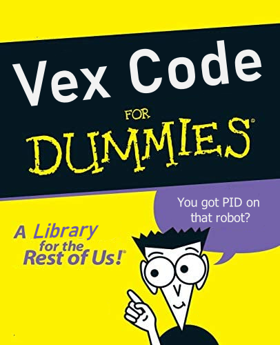

This is a library full of useful functions and classes for programming vex robots.

If you're new to coding I've also included some tutorials for getting started.

## Features:

- Utility functions such as:
  - Max/Min
  - Clamp
  - Radian and Degree conversion
- The Vector2 data type
  - Useful for field posistions and more
- A Drivetrain Class allowing for easy creation and control of drivetrains
- A PID controller
- Odometry
- Pure pursuit
